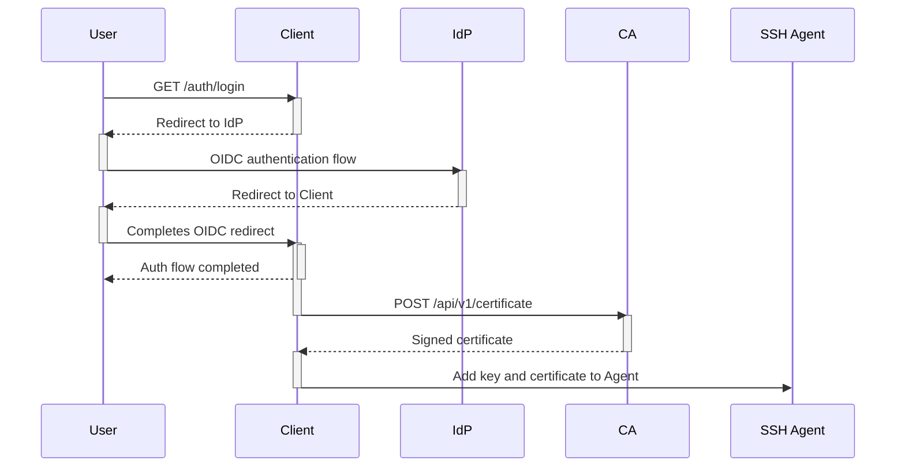
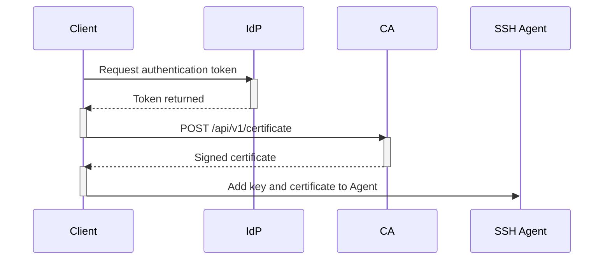
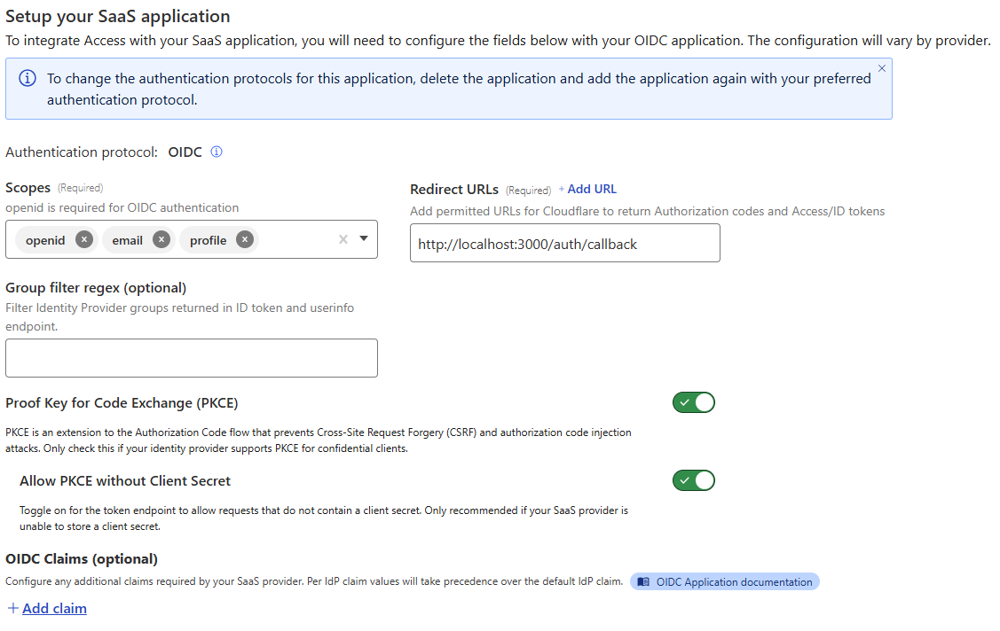
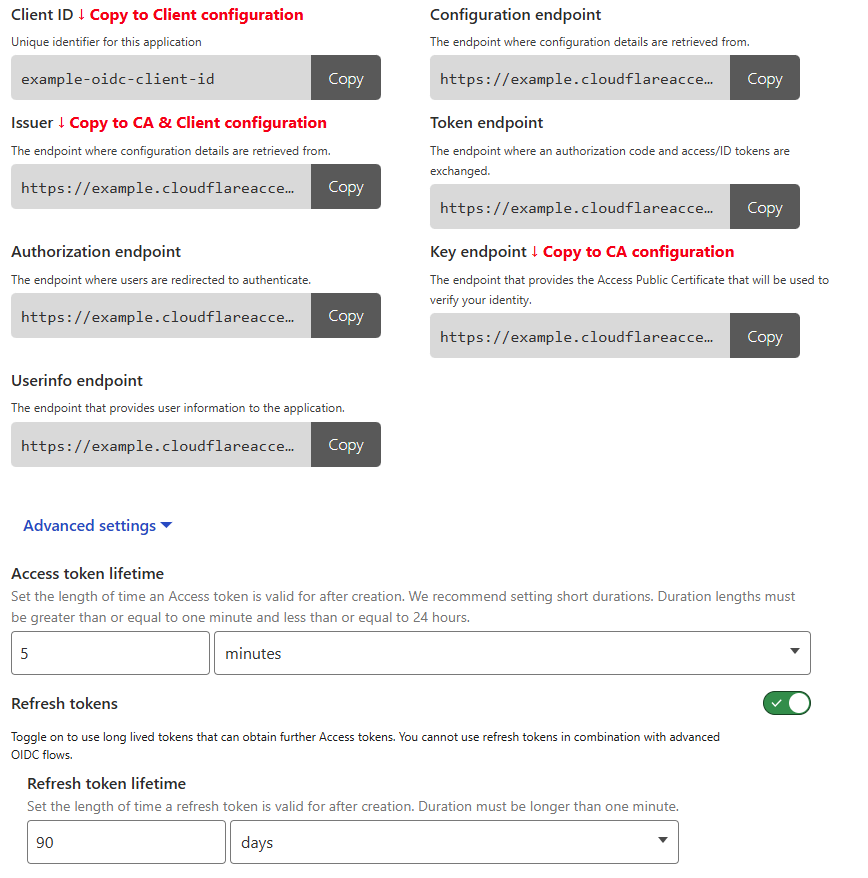

# Serverless SSH CA in Workers

[](https://deploy.workers.cloudflare.com/?url=https%3A%2F%2Fgithub.com%2Fandrewheberle%2Fserverless-ssh-ca)

This repository contains a serverless Certificate Authority that can be used
to provide signed certificates for SSH access running on Cloudflare Workers.

## Architecture

The solutions comprises of the CA running as a Worker, a Go based client and 
an external OIDC IdP (this not provided as part of this solution).

The IdP may be any OIDC compatible service that returns a JWT with at least
an `email` claim in the OIDC access token, however at this time only
Cloudflare Access has been tested.

The flow to obtain a certificate using the CLI version is as follows:

1. The user initiates `ssh-ca-client-cli login`
2. If required a new SSH key is generated and the a browser is opened to
   visit `http://localhost:3000/auth/login`
3. The client redirects the user to the configured IdP
4. The IdP returns the user to the callback URL (default
   `http://localhost:3000/auth/callback`)
5. The client uses the JWT from the IdP as `Authorization: Bearer <TOKEN>`
   in a `POST` request containing the users SSH public key to the CA's
   `/api/v1/certificate` endpoint
6. The CA verifies the incoming JWT and assuming it is valid and verified, will 
   respond with a signed certificate based on the provided public key
7. The client saves the certificate and adds the SSH private key and
   certificate to the local SSH Agent.

This flow is shown below once the user executes `ssh-ca-client-cli login`:



If a refresh token is available, the process looks like this when running
`ssh-ca-client-cli login`:



If the process to request a new authentication token fails using the refresh
token, the standard authentication process is followed which requires user
interaction.

## Deployment

Once you have cloned this repository, firstly install the dependencies:

```sh
npm install
```

1. Edit the variables in `wrangler.jsonc`:

```jsonc
"vars": {
    // This is the issuer of your SSH certificates
    "ISSUER_DN": "CN=SSH CA,O=Internet Widgets Pty Ltd,C=US",
    // This is the URL for the CA to verify the JWT provided by the client
    "JWT_JWKS_URL": "https://example.com/.well-known/jwks.json",
    // The issuer of the JWT access token
    "JWT_ISSUER": "https://example.com/",
    // The supported JWT algorithms
    "JWT_ALGORITHMS": ["RS256"],
    // An OIDC claim included in the users identity token that will be used to
    // populate the list of principals on the issued certificate 
    "JWT_SSH_CERTIFICATE_PRINCIPALS_CLAIM": "groups",
    // The lifetime of the issued SSH certificates
    "SSH_CERTIFICATE_LIFETIME": "24 hours",
    // A list of additional principals to add to the certificate
    "SSH_CERTIFICATE_PRINCIPALS": ["ssh-admin"],
    // Whether to add the users own name as a valid principal
    "SSH_CERTIFICATE_INCLUDE_USER": false,
    // The list of SSH extensions to add to the certificate
    "SSH_CERTIFICATE_EXTENSIONS": [
        "permit-X11-forwarding",
        "permit-agent-forwarding",
        "permit-port-forwarding",
        "permit-pty",
        "permit-user-rc",
    ]
},
```

2. Add the private key for your SSH CA to your Cloudflare Secrets Store:

```jsonc
"secrets_store_secrets": [
    {
        "binding": "PRIVATE_KEY",
        // The ID of the secret store
        "store_id": "<secret store id>",
        // The name of the secret
        "secret_name": "<secret name>"
    }
]
```

The secret should be an OpenSSH private key generated as follows:

```sh
ssh-keygen -t ecdsa -b 256 -f path/to/ca_key
```

Other key types and sizes apart from ECDSA should work fine but are untested.

3. Generate the Worker types for your deployment:

```sh
npm run cf-typegen
```

4. Deploy your Worker:

```sh
npm run deploy
```

## Configuration

### Identity Provider

This example shows the configuration in Cloudflare Access, however other
OIDC IdP's should be generally equivalent:



The `Redirect URL` must match the configured value in the client.

Transfer the IdP settings as follows:



The `openid` and `email` scopes are required, with enabling of refresh tokens
(the `offline_access` scope) being optional, but recommended.

### Client

The client requires a configuration file that defines the details of the OIDC
IdP and where to find the SSH CA as follows:

```yaml
issuer: OIDC Issuer
client_id: OIDC Client ID
scopes: ["openid", "email", "profile"]
redirect_url: http://localhost:3000/auth/callback
ca_url: https://ssh-ca.example.com/
```

The default location of this configuration file is `$HOME/.ssh-serverless-ca/config.yml`
however this can be overridden using the `--config` command line option.

#### Installation

Please download the client for your OS from the releases page.

#### Usage

Assuming a local SSH agent is running, the client can be started as follows:

```sh
# generate a SSH private key
ssh-ca-client-cli generate

# perform a login to the IdP and request a signed certificate
ssh-ca-client-cli login
```

This should automatically start a web browser to initiate the OIDC login flow,
if not you may manually visit `http://localhost:3000/auth/login` to start this
process.

If provided by the OIDC IdP the refresh token will be saved for subsequent
`ssh-ca-client login` invocations and an attempt will be made to obtain a new
auth token using the saved refresh token.

#### Key, Token and Certificate Storage

The users private key, the most recently issued certificate and the OIDC
refresh token (if available) are written to a user specific configuration file
for subsequent use.

Sensitive material such as the SSH private key and OIDC refresh token are
encrypted on Windows using the Data Protection API (DPAPI) so the values are
only decryptable by the same user that originally encrypted it.

Although access to the config file by another user is possible, the values
cannot be read (assuming DPAPI is secure).

On other platforms, this is not the case and this data is simply stored as 
BASE64 encoded strings, so security is less than ideal and filesystem
permissions must be used to prevent unauthorised access.

### SSH Endpoints

For systems to allow SSH login using certiifcates the following configuration
changes must be made:

```ssh
PubkeyAuthentication yes
TrustedUserCAKeys /etc/ssh/ca.pub
AuthorizedPrincipalsFile /etc/ssh/principals.d/%u
```

The contents of `/etc/ssh/ca.pub` is the public key of the SSH CA, which can be
retrieved as follows:

```sh
curl https://ssh-ca.example.com/api/v1/ca | sudo tee /etc/ssh/ca.pub
```

The `/etc/ssh/principals.d` directory should contain a file corresponding to
a local user that contains a list of principals that should be allowed
login.

Using the principals list in `SSH_CERTIFICATE_PRINCIPALS` above, the
following file named `/etc/ssh/principals.d/admin` would allow login
as the SSH user `admin` for the bearer of an issued (and valid) certificate:

```
ssh-admin
```

# Attributions

The icons used by the client are made by Freepik from [www.flaticon.com](https://www.flaticon.com).
